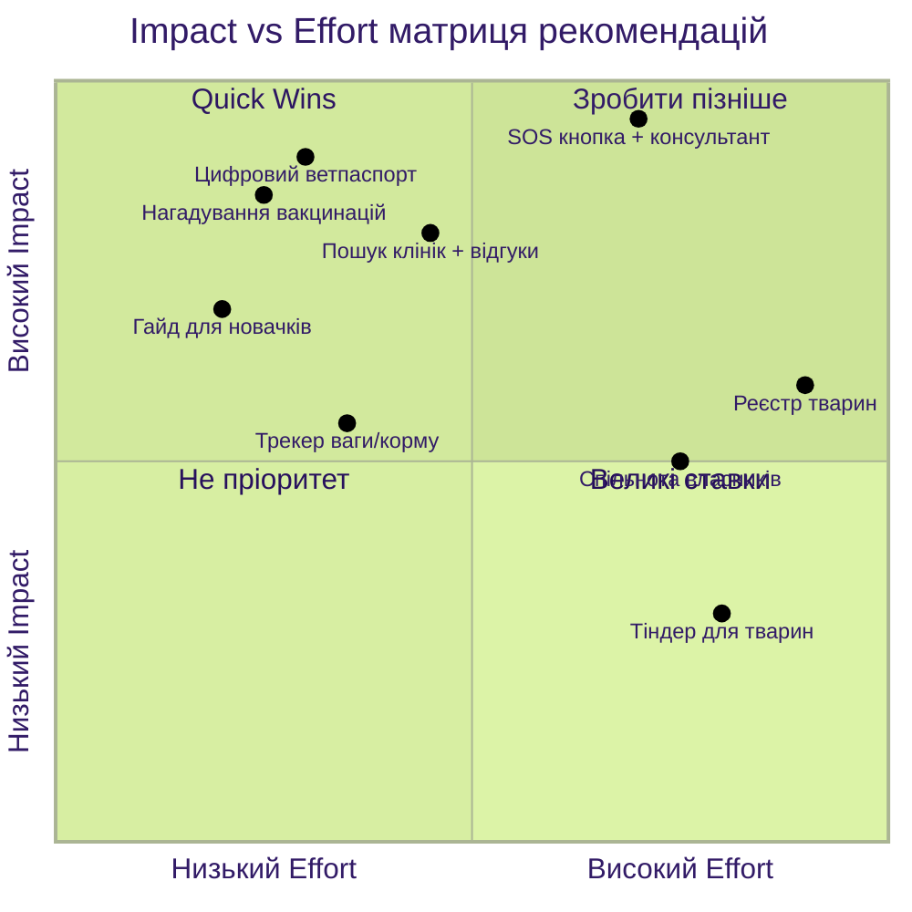

# Аналіз інтерв'ю: Догляд за домашніми тваринами

## 1. Executive Summary

Проаналізовано **3 інтерв'ю** з власниками домашніх тварин (коти, собаки). Респонденти — активні міські мешканці, які стикаються зі спільними проблемами: **відсутність єдиного цифрового інструменту** для управління здоров'ям, рутинами та екстреними ситуаціями пов'язаними з домашніми тваринами.

**Ключові інсайти:**
- Усі респонденти відчувають біль від фрагментованості інформації (паперові паспорти, різні клініки, Google-пошук)
- Найсильніша емоційна потреба — екстрена допомога та швидкий пошук ветклінік
- Існуючі додатки (Animal ID, WauDog, перекладачі гавкоту) не закривають основних потреб
- Є запит на комплексний додаток з нагадуваннями, медичною карткою, пошуком клінік та спільнотою

---

## 2. Key Findings (Value Proposition Canvas)

### Респондент: Ігор (кіт 3р., собака 7міс.)

#### Jobs (Завдання)
| # | Завдання | Цитата |
|---|----------|--------|
| J1 | Регулярні прогулянки та тренування собаки | *"Треба з ним вийти зранку... потім в день ще раз... і ввечері на повноцінну прогулянку, з тренуванням"* |
| J2 | Годування за графіком (4 рази на день) | *"Вони чотири рази їдять. Зранку десь о другій, шостій, сьомій і на ніч"* |
| J3 | Відстеження ваги та порцій корму | *"Він росте, і йому треба постійно підвищувати... постійно думаєш, блін, а чи нормально я годую"* |
| J4 | Підбір та відвідування кінолога | *"Підібрав якусь прикольну групу десь недалеко"* |
| J5 | Підготовка тварин до подорожей | *"Треба готувати тварин... купити ліки, давати їм іголки за кілька днів до поїздки"* |

#### Pains (Болі)
| # | Біль | Цитата |
|---|------|--------|
| P1 | Забуває дати вакцинацій та таблеток | *"Ти іноді забуваєш, коли ти це останнє робив і коли це час робити"* |
| P2 | Немає єдиного органайзера | *"Заносити вручну в календар... треба багато різних органайзерів завести. Якби воно було в одному місці, було б простіше"* |
| P3 | Незручність Animal ID для документів | *"Не можна просто якусь пдф завантажити... трошки геморно"* |
| P4 | Онлайн-тренування неефективні | *"Спочатку пробував онлайн... не суперкорисна штука виявилася"* |
| P5 | Розподіленість медичної історії | *"Якщо по різних клініках ходиш, то було б зручно десь в одному місці зберігати"* |

#### Gains (Вигоди)
| # | Вигода | Цитата |
|---|--------|--------|
| G1 | Єдиний кабінет клініки Zoalux | *"Все бачать, і ти все бачиш... як медична карта"* |
| G2 | Автоматичний трекінг через IoT (розумний лоток) | *"Трекає скільки він разів сходив... скільки він важить... вбудовані ваги"* |
| G3 | Вебінари від клініки | *"Різні вебінари з приводу захворювань, з зоопсихологами"* |

---

### Респондент: Даша КПІ (кішка 3р.)

#### Jobs (Завдання)
| # | Завдання | Цитата |
|---|----------|--------|
| J1 | Щоденна рутина: їжа, вода, лоток | *"Ці три пункти — їжа, вода і лоточок — в мене щозранку, щовечорі стабільно"* |
| J2 | Адаптація тваринки після переїзду | *"Ця адаптація, лоточок, де їсти... воно змінювалось. І було важко в квартирі адаптуватись"* |
| J3 | Вечірні ігри / вивільнення енергії | *"Вечірня рутина — це з нею погратися... я розумію, що вона молода"* |
| J4 | Перевірка складу корму | *"Завжди перевіряю відсоток м'яса на упаковках... дуже багато обману"* |
| J5 | Відстеження прививок та медичної історії | *"Відслідковувати кількість прививок, походів до лікаря"* |

#### Pains (Болі)
| # | Біль | Цитата |
|---|------|--------|
| P1 | Незнання базових правил догляду | *"Я не знала, що молоко кицям не можна... не можна з дитинства гратися рукою"* |
| P2 | Паніка при незрозумілих симптомах (тічка) | *"О ні, Юра, треба везти в лікарню, боже, це жах... а колеги кажуть — да це просто тічка"* |
| P3 | Довгий пошук клініки при екстрених ситуаціях (чумка) | *"Ми, напевно, день просто шукали куди звернутися... запитували знайомих через знайомих"* |
| P4 | Втрата паперового паспорта | *"З переїздами оці всі паспорти, книжечки з ветклінік, вони губляться"* |
| P5 | Страшні результати в Google | *"В інтернеті про чумку написано дуже багато страшних речей... це завжди страшні якісь речі він описує"* |

#### Gains (Вигоди)
| # | Вигода | Цитата |
|---|--------|--------|
| G1 | Поради подруги з досвідом | *"На перших порах часто зверталася до подруги, яка мені цю кицю і віддала"* |
| G2 | TikTok-блогери про харчування | *"В тіктоках дивилася за різними блогерами... про харчування котів"* |
| G3 | Бажання спільноти power-users | *"Спільнота супер-френдлі всіх людей, які люблять тварин... діляться досвідом, обмінюються інформацією"* |

---

### Респондент: Даша Дев Челендж (собака шпіц 4р.)

#### Jobs (Завдання)
| # | Завдання | Цитата |
|---|----------|--------|
| J1 | Прогулянки 3 рази на день | *"Прокидаєшся... ти мусиш йти. Холодно, не холодно, дощ, але собачка має сходити в туалет"* |
| J2 | Контроль дієти та ваги | *"Собака схудла на півтора кілограма, це 15 відсотків маси собаки"* |
| J3 | Регулярні вакцинації та ветвізити | *"Кожен рік є стабільний набір. Їх там три, цих прививків"* |
| J4 | Пошук ветклініки 24/7 | *"Небагато клінік, що працює 24 на 7... тільки за 10 кілометрів від нас якась клініка"* |
| J5 | Гігієна та догляд за шерстю | *"Мити раз-два на тиждень, і вітаміни давати, і якісь бати, і крапельки"* |

#### Pains (Болі)
| # | Біль | Цитата |
|---|------|--------|
| P1 | Мовчазні ветеринари | *"Лікар просто мовчить, сам собі щось робиш, і ти маєш його питати"* |
| P2 | Відсутність 24/7 клінік поруч | *"Дивимося, що тільки за 10 кілометрів від нас якась клініка, яка працює"* |
| P3 | Фрагментована інформація в інтернеті | *"Дуже багато різних сайтів, і в кожної різна відповідь, і ти не знаєш, що робити"* |
| P4 | Небезпечні продукти для собак | *"Авокадо для нас корисне, а для собаків — це смерть. Багато людей про інші продукти не знає"* |
| P5 | Екстрені ситуації вдома | *"Якийсь муравей до лютика вуха заповз... це дуже тяжко"* |

#### Gains (Вигоди)
| # | Вигода | Цитата |
|---|--------|--------|
| G1 | Телеграм-канали з досвідом | *"Класні поради від людей, бо хтось вже стикався з цією ж проблемою"* |
| G2 | Спілкування на прогулянках | *"Зустрічаєш людей з собачками... багато хто розкаже і про клініки, і про вакцинацію"* |
| G3 | QR-код WauDog для безпеки | *"Купили спеціальний QR-код, який може і відстежувати собаку... must-have для кожної тварини"* |

---

## 3. Recommendations (ранжовано за Impact / Effort)



### Таблиця рекомендацій

| # | Рекомендація | Impact | Effort | Пріоритет |
|---|-------------|--------|--------|-----------|
| R1 | **Цифровий ветпаспорт** — зберігання вакцинацій, аналізів, документів в одному місці з можливістю завантаження PDF | 🔴 Високий | 🟢 Низький | 🥇 P0 |
| R2 | **Нагадування про вакцинації та процедури** — автоматичні пуші за графіком (раз на місяць, квартал, рік) | 🔴 Високий | 🟢 Низький | 🥇 P0 |
| R3 | **Гайд для новачків** — чекбокси, що робити в перші 5 місяців (корм, привчання, прививки, заборонені продукти) | 🔴 Високий | 🟢 Низький | 🥇 P0 |
| R4 | **Пошук клінік + відгуки** — карта клінік з фільтрами (24/7, стаціонар, великі тварини) та рейтингами | 🔴 Високий | 🟡 Середній | 🥈 P1 |
| R5 | **Трекер ваги та порцій корму** — автоматичний розрахунок порцій за віком/вагою тварини | 🟡 Середній | 🟢 Низький | 🥈 P1 |
| R6 | **SOS-кнопка + онлайн-консультант** — екстрена лінія з ветеринаром для первинної діагностики | 🔴 Високий | 🔴 Високий | 🥉 P2 |
| R7 | **Спільнота власників тварин** — обмін досвідом, пошук вигулу разом, поради | 🟡 Середній | 🔴 Високий | 🥉 P2 |
| R8 | **Єдиний реєстр тварин** — чіпування, вакцинації, підтвердження безпеки для подорожей | 🟡 Середній | 🔴 Високий | ⬜ P3 |
| R9 | **Метчинг для розведення** — пошук пар для злучення за породою та локацією | 🟢 Низький | 🔴 Високий | ⬜ P3 |

---

## Зведена карта болей (спільні для всіх респондентів)

```mermaid
---
config:
  layout: elk
  theme: forest
  look: classic
---
mindmap
  root((Болі власників<br/>домашніх тварин))
    Інформація
      Фрагментована в інтернеті
      Страшні результати Google
      Немає єдиного джерела
      Незнання базових правил
    Медичні записи
      Паперовий паспорт губиться
      Забувають дати вакцинацій
      Різні клініки не бачать історію
      Незручні існуючі додатки
    Екстрені ситуації
      Пошук клініки займає годинник
      Немає 24/7 клінік поруч
      Паніка при невідомих симптомах
      Не знаєш першу допомогу
    Рутинний догляд
      Контроль ваги та порцій
      Графік таблеток та капель
      Адаптація при переїздах
      Небезпечні продукти
```
