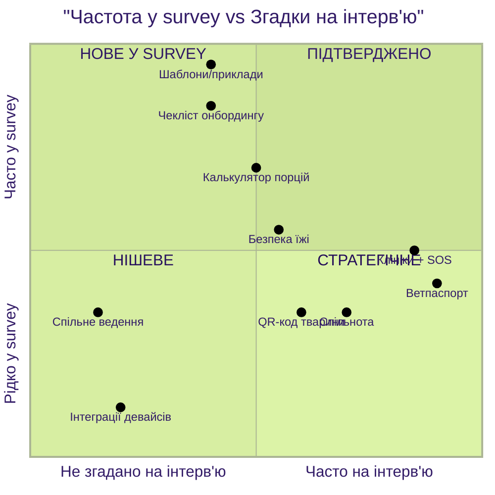
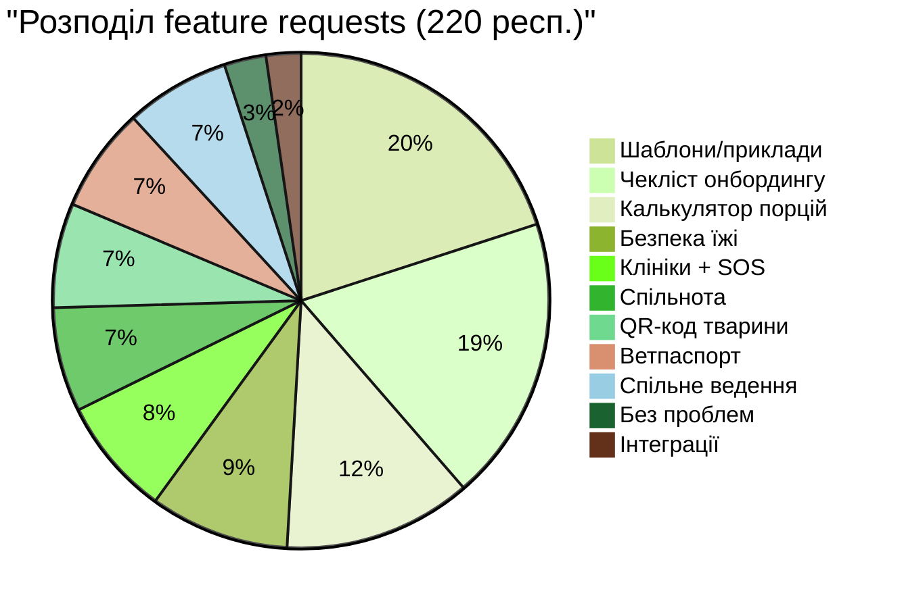

# Порівняння: Інтерв'ю vs Онбординг-опитування

## 1. Executive Summary

Порівняно якісні дані з **3 глибинних інтерв'ю** з кількісними даними **220 відповідей** онбординг-опитування. Результати демонструють **сильну кореляцію** — болі, виявлені на інтерв'ю, підтверджуються масовим опитуванням, але з'являються й **нові інсайти**, які інтерв'ю не покрили.

**Ключові висновки:**
- NPS = **-30.0** (критично низький) — майже половина юзерів (49.1%) є детракторами
- Топ-3 запити з опитування повністю збігаються з болями з інтерв'ю
- Інтерв'ю виявили правильні стратегічні напрямки, але **недооцінили** проблеми онбордингу (шаблони, чекліст, калькулятор порцій)
- Опитування виявило **2 нові потреби**, які не згадувалися на інтерв'ю: спільне ведення господарства та інтеграції з девайсами

---

## 2. Загальна статистика опитування

| Метрика | Значення |
|---------|----------|
| Всього респондентів | 220 |
| Середній NPS | 6.6 |
| Медіана NPS | 7.0 |
| Промоутери (9-10) | 42 (19.1%) |
| Пасивні (7-8) | 70 (31.8%) |
| Детрактори (0-6) | 108 (49.1%) |
| **NPS Score** | **-30.0** |

---

## 3. Матриця порівняння: Інтерв'ю vs Опитування

### Детальна таблиця порівняння

| Потреба | Інтерв'ю (3 респ.) | Survey (220 респ.) | Survey % | Avg NPS | Статус |
|---------|--------------------|--------------------|----------|---------|--------|
| **Шаблони / приклади** | Даша КПІ: "гайд для першого котика, чекбокси" | 44 feature requests + 29 confusion | **20.0%** | 5.9 | Підтверджено + розширено |
| **Чекліст онбордингу** | Даша КПІ: "маякував, що перевірь" | 41 feature requests + 36 confusion | **18.6%** | 6.0 | Підтверджено + розширено |
| **Калькулятор порцій** | Ігор: "постійно думаєш, чи нормально годую" | 27 feature requests + 47 confusion | **12.3%** | 6.8 | Підтверджено + розширено |
| **Безпека їжі** | Даша ДЧ: "авокадо для собаків — це смерть" | 20 feature requests + 20 confusion | **9.1%** | 6.5 | Підтверджено |
| **Клініки + SOS** | Даша КПІ: "день шукали куди звернутися" | 17 feature requests + 21 confusion | **7.7%** | 7.5 | Підтверджено |
| **Ветпаспорт цифровий** | Всі 3: "паспорти губляться" | 15 feature requests | **6.8%** | 5.5 | Підтверджено |
| **Спільнота** | Даша КПІ: "спільнота супер-френдлі" | 15 feature requests + 15 confusion | **6.8%** | 7.1 | Підтверджено |
| **QR-код тварини** | Ігор, Даша ДЧ: WauDog | 15 feature requests | **6.8%** | 8.3 | Підтверджено |
| **Спільне ведення** | — (лише Даша КПІ: "чоловік забудькований") | 15 feature requests | **6.8%** | 7.9 | **Нове** |
| **Інтеграції девайсів** | Ігор згадував розумний лоток | 5 feature requests | **2.3%** | 6.6 | Нішеве |

---

## 4. Що підтвердилось

### Повний збіг (інтерв'ю → survey)

1. **Цифровий ветпаспорт** — на інтерв'ю всі 3 респонденти скаржились на паперовий паспорт. У survey 15 юзерів прямо просять digital storage, і вони мають **найнижчий NPS (5.5)** — це група найбільш незадоволених юзерів.

   > Ігор: *"Заносити вручну в календар... треба багато різних органайзерів завести"*
   > Survey USR00017: *"I lose paper vet documents when moving"*

2. **Екстрена допомога + SOS** — Даша КПІ описала день пошуку клініки для кішки з чумкою. 21 юзер у survey згадує паніку та потребу SOS.

   > Даша КПІ: *"Ми, напевно, день просто шукали куди звернутися"*
   > Survey USR00030: *"When something felt wrong, I panicked and googled scary stuff"*

3. **Небезпечні продукти** — Даша ДЧ описувала проблему з авокадо. 20 юзерів хочуть safe food lookup.

   > Даша ДЧ: *"Авокадо для нас корисне, а для собаків — це смерть"*
   > Survey USR00012: *"Wanted a quick 'can my pet eat this?' check"*

---

## 5. Що інтерв'ю недооцінили

### Проблеми онбордингу — найбільша група у survey

Інтерв'ю проводились з **досвідченими власниками**, тому вони фокусувались на стратегічних потребах (SOS, реєстр, спільнота). Але survey показує, що **38.6% юзерів** (шаблони + чекліст) відвалюються вже на етапі онбордингу:

| Проблема онбордингу | Survey % | Avg NPS |
|--------------------|----------|---------|
| Шаблони / приклади | 20.0% | 5.9 |
| Чекліст / next action | 18.6% | 6.0 |
| **Разом** | **38.6%** | **~6.0** |

Ці юзери мають NPS 5.9-6.0 — майже всі детрактори. **Це головний bottleneck продукту.**

### Калькулятор порцій — прихований лідер

На інтерв'ю лише Ігор коротко згадав проблему з порціями. Але у survey **47 юзерів (21.4%)** описують confusion саме з годуванням — це **найчастіша одиночна проблема** при онбордингу.

> Survey USR00059: *"Kept thinking 'am I feeding too much or too little?'"*
> Survey USR00101: *"I didn't understand how to split portions across meals"*

### Спільне ведення господарства — нова потреба

На інтерв'ю лише Даша КПІ побічно згадала: *"Чоловік більш забудькований"*. Але у survey 15 юзерів (6.8%) прямо просять shared tracking з високим NPS (7.9) — це лояльні юзери, яких можна порадувати.

> Survey USR00055: *"We double-fed because we didn't coordinate"*
> Survey USR00046: *"Wanted a shared log so I don't have to ask 'did you feed?'"*

---

## 6. Що інтерв'ю переоцінили

| Потреба з інтерв'ю | Згадки на інтерв'ю | Survey % | Висновок |
|--------------------|---------------------|----------|----------|
| Реєстр тварин (державний) | Даша КПІ — розлогий запит | 0% | Занадто амбіційно для MVP |
| Тіндер для тварин / злучення | Даша КПІ — ідея | 0% | Не валідовано |
| Вебінари від клінік | Ігор — цінує | 0% | Нішева потреба |

---

## 7. Оновлені рекомендації (з урахуванням survey)

### Пріоритизація (оновлена з survey даними)

| # | Рекомендація | Interview | Survey % | Avg NPS | Пріоритет |
|---|-------------|-----------|----------|---------|-----------|
| 1 | **Шаблони та приклади при онбордингу** — prefilled плани, "copy a typical plan" | Даша КПІ: гайд | 20.0% | 5.9 | 🔴 **P0 — CRITICAL** |
| 2 | **Покроковий чекліст онбордингу** — guided path замість open-ended forms | Даша КПІ: маякувати | 18.6% | 6.0 | 🔴 **P0 — CRITICAL** |
| 3 | **Калькулятор порцій** — за вагою/віком, split по прийомам їжі | Ігор: порції | 12.3% | 6.8 | 🔴 **P0** |
| 4 | **Safe food lookup** — "can my pet eat this?" швидка перевірка | Даша ДЧ: авокадо | 9.1% | 6.5 | 🟡 **P1** |
| 5 | **Пошук клінік + SOS** — 24/7 фільтр, відгуки, кнопка екстреної допомоги | Даша КПІ: день шукала | 7.7% | 7.5 | 🟡 **P1** |
| 6 | **Цифровий ветпаспорт** — завантаження PDF, історія вакцинацій | Всі 3 | 6.8% | 5.5 | 🟡 **P1** |
| 7 | **Спільне ведення** — shared log, розділення відповідальності | Нове у survey | 6.8% | 7.9 | 🟢 P2 |
| 8 | **QR-код / ID тварини** | Ігор, Даша ДЧ | 6.8% | 8.3 | 🟢 P2 |
| 9 | **Спільнота власників** | Даша КПІ | 6.8% | 7.1 | 🟢 P2 |
| 10 | **Інтеграції з девайсами** | Ігор: лоток | 2.3% | 6.6 | ⬜ P3 |

---

## 8. Висновки та наступні кроки

### Що змінилося після survey:

1. **Пріоритет онбордингу різко зріс** — P0 замість P1. Без шаблонів та чеклісту ми втрачаємо ~39% юзерів на старті.
2. **Калькулятор порцій піднявся до P0** — 21.4% confusion при онбордингу, хоча на інтерв'ю це було побічною згадкою.
3. **Ветпаспорт підтверджений кількісно**, але група невелика (6.8%). Зате у неї найнижчий NPS (5.5) — це найнезадоволеніші юзери.
4. **Реєстр тварин та "тіндер для тварин"** з інтерв'ю **не валідовані** survey — відкладаємо.
5. **Shared household tracking** — нова потреба, якої не було на інтерв'ю, але вона має високий NPS (7.9) — лояльна аудиторія.

### Рекомендований порядок дій:
1. Виправити онбординг (шаблони + чекліст + калькулятор порцій) → очікуване зростання NPS на +15-20 пунктів
2. Додати safe food lookup та пошук клінік
3. Реалізувати цифровий ветпаспорт для утримання найнезадоволенішої когорти
4. Будувати social features (спільнота, shared tracking) для зростання retention
