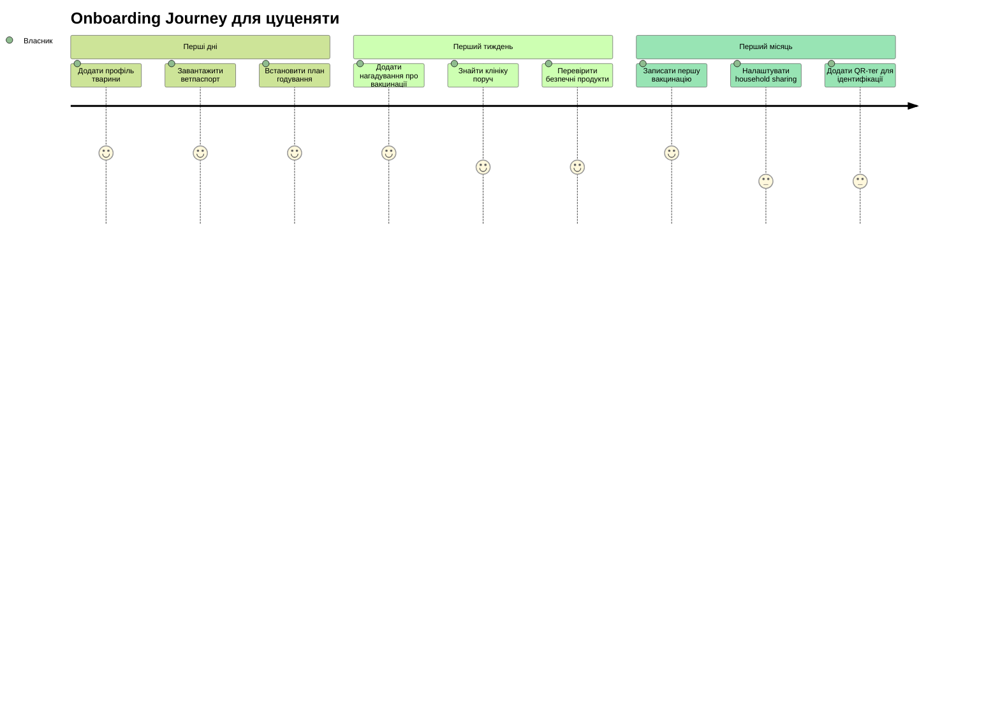
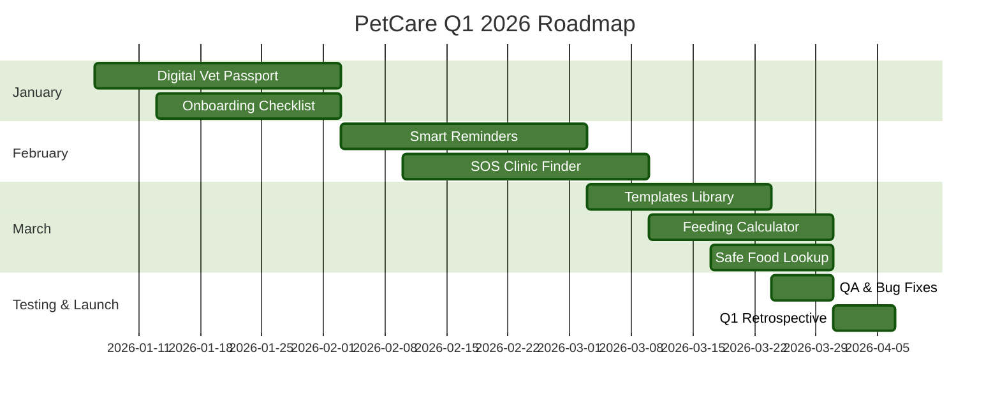

# PetCare Q1 2026 Product Roadmap

**Дата створення:** Січень 2026  
**Базується на:** Валідованих даних з інтерв'ю (n=3) та опитування (n=220)

---

## Executive Summary

Роадмап Q1 2026 фокусується на **критичних болях користувачів**, виявлених у дослідженнях:
- 🔥 Фрагментація інформації та втрата документів
- 🔥 Відсутність нагадувань про вакцинації
- 🔥 Складність пошуку екстреної допомоги 24/7
- 🔥 Брак знань у нових власників

**Ключова метрика успіху Q1:** NPS > 0 (поточний: -20.5)

---

## Q1 2026 Strategic Priorities

### Квартальна мета

Трансформувати PetCare з "трекера корму" в **універсальний хаб для догляду за тваринами**, вирішуючи топ-4 болі користувачів.

### Success Metrics

| Метрика | Поточне | Ціль Q1 | Вимірювання |
|---------|:-------:|:-------:|-------------|
| **NPS Score** | -20.5 | > 0 | Щомісячне опитування |
| **Onboarding Completion** | ? | > 80% | % користувачів, що завершили setup |
| **Weekly Active Users** | ? | +50% | WAU з оновленням даних |
| **"No major issues"** | 2.7% | > 10% | % задоволених у опитуванні |

---

## January 2026: Foundation (Weeks 1-4)

### Epic A: Digital Vet Passport 🏥

**Проблема:** *"Інколи буває, ти не можеш знайти паспорт"* — Даша КПІ  
**Дані:** 8.2% опитаних згадують втрату документів

#### User Stories

```
✅ US-101: Як власник, я хочу зберігати вакцинації в додатку, щоб не шукати паперовий паспорт
✅ US-102: Як власник, я хочу завантажувати PDF/фото документів, щоб мати їх завжди під рукою
✅ US-103: Як власник, я хочу бачити історію хвороб, щоб показати новому лікарю
✅ US-104: Як власник, я хочу експортувати медкарту в PDF, щоб надіслати в клініку
```

#### Acceptance Criteria

- [ ] Можливість додати запис про вакцинацію (дата, назва, клініка)
- [ ] Завантаження документів (PDF, JPG, PNG) до 10MB
- [ ] Перегляд історії у хронологічному порядку
- [ ] Експорт медкарти в PDF з логотипом PetCare
- [ ] Синхронізація між пристроями в household

#### Technical Notes

- Використати Firebase Storage для документів
- OCR для автоматичного розпізнавання дат (nice-to-have)
- Шифрування медичних даних (GDPR compliance)

#### Impact

| Метрика | Очікування |
|---------|-----------|
| Onboarding completion | +15% |
| Weekly visits | +20% |
| Feature adoption | > 60% користувачів додають мін. 1 документ |

---

### Epic B: Onboarding Checklist with Guided Path 🎯

**Проблема:** *"Setup felt like a checklist was missing"* — 42 згадки (19.1%)  
**Дані:** Найчастіша скарга в опитуванні

#### User Stories

```
✅ US-201: Як новий власник, я хочу бачити чекліст перших кроків, щоб нічого не пропустити
✅ US-202: Як власник цуценяти, я хочу guided path для перших 5 місяців, бо це критичний період
✅ US-203: Як власник, я хочу бачити прогрес виконання, щоб відчувати себе впевнено
✅ US-204: Як власник, я хочу приклади/шаблони, щоб не починати з нуля
```

#### Acceptance Criteria

- [ ] Персоналізований чекліст на основі типу тварини (собака/кіт) та віку
- [ ] Візуальний прогрес-бар (% завершення)
- [ ] Шаблони для типових сценаріїв (цуценя, доросла собака, кошеня)
- [ ] Можливість "skip" необов'язкових кроків
- [ ] Нагадування про незавершені кроки

#### Checklist Items (приклад для цуценяти)



#### Impact

| Метрика | Очікування |
|---------|-----------|
| Onboarding completion | +35% (найбільший impact) |
| Time to first value | -50% |
| 7-day retention | +25% |

---

## February 2026: Critical Features (Weeks 5-8)

### Epic C: Smart Reminders System 🔔

**Проблема:** *"Різні терміни вакцинацій... іноді забуваєш"* — Ігор  
**Дані:** 19.1% опитаних потребують нагадувань

#### User Stories

```
✅ US-301: Як власник, я хочу автоматичні нагадування про вакцинації, щоб не забувати
✅ US-302: Як власник, я хочу нагадування про таблетки від глистів, щоб не пропускати
✅ US-303: Як власник, я хочу налаштувати час нагадувань, щоб вони були зручними
✅ US-304: Як член household, я хочу бачити чи хтось вже виконав задачу, щоб не дублювати
```

#### Acceptance Criteria

- [ ] Автоматичні нагадування на основі графіка вакцинацій
- [ ] Push-нотифікації з можливістю "Done" / "Snooze"
- [ ] Календарна інтеграція (Google Calendar, Apple Calendar)
- [ ] Синхронізація статусу між household members
- [ ] Пріоритезація нагадувань (критичні vs некритичні)

#### Notification Strategy

| Тип | Коли | Тон | Приклад |
|-----|------|-----|---------|
| Вакцинація | 7 днів до + день-в-день | Важливо, але не панічно | "🐕 Час вакцинації від сказу для Рекса. Записатися в клініку?" |
| Таблетки | День-в-день вранці | Дружній нагадування | "☀️ Доброго ранку! Не забудьте таблетку від глистів для Мурчика" |
| Низький запас корму | 3 дні до закінчення | Проактивний | "🍖 Корм закінчується через 3 дні. Замовити зараз?" |

#### Technical Notes

- Використати Firebase Cloud Messaging для push
- Background jobs для розрахунку нагадувань
- Локальні нотифікації як fallback

#### Impact

| Метрика | Очікування |
|---------|-----------|
| Missed vaccinations | -40% |
| Daily active users | +30% |
| Feature adoption | > 70% увімкнуть нагадування |

---

### Epic D: SOS Clinic Finder 24/7 🚨

**Проблема:** *"Ми день просто шукали, куди звернутися"* — Даша Дев  
**Дані:** 10% опитаних потребують екстреної допомоги

#### User Stories

```
✅ US-401: Як власник, я хочу знайти клініку 24/7 поруч, щоб не витрачати години на пошук
✅ US-402: Як власник, я хочу бачити реальні відгуки, щоб обрати надійну клініку
✅ US-403: Як власник, я хочу фільтри (24/7, хірургія, УЗД), щоб знайти потрібні послуги
✅ US-404: Як власник, я хочу SOS-кнопку з чекліст "чи це екстрено?", щоб не панікувати
```

#### Acceptance Criteria

- [ ] Карта клінік з фільтрами (24/7, послуги, відстань)
- [ ] Реальні відгуки користувачів (інтеграція з Google Reviews)
- [ ] "Call now" кнопка для прямого дзвінка
- [ ] SOS-чекліст для оцінки терміновості
- [ ] Збереження обраних клінік

#### SOS Checklist Logic

```
Питання 1: Чи є кровотеча?
  → Так: 🚨 ТЕРМІНОВА ДОПОМОГА. Дзвонити зараз.
  → Ні: Питання 2

Питання 2: Чи тварина в свідомості?
  → Ні: 🚨 ТЕРМІНОВА ДОПОМОГА. Дзвонити зараз.
  → Так: Питання 3

Питання 3: Чи є блювота/діарея більше 24 год?
  → Так: ⚠️ Рекомендовано візит сьогодні.
  → Ні: ℹ️ Моніторити стан. Якщо погіршення — дзвонити.
```

#### Technical Notes

- Інтеграція з Google Maps API
- Партнерство з ветклініками для верифікації даних
- Геолокація для сортування за відстанню

#### Impact

| Метрика | Очікування |
|---------|-----------|
| Time to find clinic | -70% |
| Emergency satisfaction | +50% |
| Feature adoption | > 40% використають мін. 1 раз |

---

## March 2026: Enhancement & Validation (Weeks 9-13)

### Epic E: Templates & Examples Library 📚

**Проблема:** *"Wanted prefilled examples"* — 38 згадок (17.3%)  
**Дані:** 2-га за частотою скарга в опитуванні

#### User Stories

```
✅ US-501: Як новий власник, я хочу готові шаблони планів годування, щоб не вигадувати з нуля
✅ US-502: Як власник, я хочу приклади графіків вакцинацій, щоб зрозуміти норму
✅ US-503: Як власник, я хочу копіювати план іншого користувача, якщо він підходить
✅ US-504: Як власник, я хочу зберігати свої шаблони, щоб використати для наступної тварини
```

#### Acceptance Criteria

- [ ] Бібліотека шаблонів (годування, вакцинації, догляд)
- [ ] Фільтри за породою, віком, типом тварини
- [ ] "Use this template" з можливістю редагування
- [ ] Збереження власних шаблонів
- [ ] Рейтинг шаблонів від спільноти

#### Template Categories

| Категорія | Приклади |
|-----------|----------|
| **Годування** | "Цуценя 2-6 міс", "Доросла собака середньої породи", "Кіт на дієті" |
| **Вакцинації** | "Стандартний графік для собак", "Графік для котів indoor", "Графік для котів outdoor" |
| **Догляд** | "Щоденний догляд за довгошерстим котом", "Тижневий чекліст для собаки" |

#### Impact

| Метрика | Очікування |
|---------|-----------|
| Setup time | -40% |
| Template usage | > 50% використають шаблон |
| User satisfaction | +20% |

---

### Epic F: Feeding Calculator with Portion Distribution 🍖

**Проблема:** *"Kept thinking 'am I feeding too much or too little?'"* — 28 згадок (12.7%)  
**Дані:** Особливо актуально для цуценят

#### User Stories

```
✅ US-601: Як власник цуценяти, я хочу автоматичний розрахунок порцій на основі ваги/віку
✅ US-602: Як власник, я хочу розподіл денної норми на прийоми їжі, щоб не перегодовувати
✅ US-603: Як власник, я хочу коригування порцій при зміні ваги, щоб підтримувати форму
✅ US-604: Як власник, я хочу поради щодо переходу на новий корм, щоб не зашкодити
```

#### Acceptance Criteria

- [ ] Калькулятор на основі ваги, віку, активності
- [ ] Розподіл на 2-3 прийоми їжі (налаштовується)
- [ ] Візуалізація порцій (грами + мірні стакани)
- [ ] Автоматичне коригування при оновленні ваги
- [ ] Поради щодо переходу між кормами

#### Calculation Logic

```
Базова формула (приклад для собак):
Daily calories = 70 × (weight in kg)^0.75 × activity_factor

Activity factors:
- Низька активність (indoor, старша тварина): 1.2
- Середня активність (2-3 прогулянки): 1.6
- Висока активність (спорт, робоча собака): 2.0

Для цуценят (до 12 міс): × 2.0 додатково
```

#### Impact

| Метрика | Очікування |
|---------|-----------|
| Feature adoption | > 60% власників цуценят |
| Weight tracking | +40% користувачів додають вагу |
| User confidence | +30% відчувають себе впевнено |

---

### Epic G: Safe Food Lookup 🥗

**Проблема:** *"I wasn't sure what foods are dangerous vs safe"* — 22 згадки (10%)  
**Дані:** Критично для нових власників

#### User Stories

```
✅ US-701: Як власник, я хочу швидко перевірити "чи можна цей продукт?", щоб не нашкодити
✅ US-702: Як власник, я хочу бачити причину (чому небезпечно), щоб розуміти ризики
✅ US-703: Як власник, я хочу альтернативи безпечних продуктів, щоб урізноманітнити раціон
✅ US-704: Як власник, я хочу сканувати штрих-код корму, щоб перевірити склад
```

#### Acceptance Criteria

- [ ] База даних 200+ продуктів (безпечні/небезпечні)
- [ ] Пошук за назвою + автокомпліт
- [ ] Рівні небезпеки (токсично / помірно / безпечно)
- [ ] Пояснення + симптоми отруєння
- [ ] Альтернативи для небезпечних продуктів

#### Database Structure

| Продукт | Собаки | Коти | Причина | Симптоми |
|---------|:------:|:----:|---------|----------|
| Шоколад | ❌ Токсично | ❌ Токсично | Теобромін | Блювота, судоми, смерть |
| Молоко | ⚠️ Обережно | ⚠️ Обережно | Лактоза | Діарея |
| Морква | ✅ Безпечно | ✅ Безпечно | — | — |
| Виноград | ❌ Токсично | ⚠️ Обережно | Невідома токсина | Ниркова недостатність |

#### Impact

| Метрика | Очікування |
|---------|-----------|
| Feature adoption | > 50% використають мін. 1 раз |
| Emergency calls | -20% (менше отруєнь) |
| User confidence | +25% |

---

## Q1 End-of-Quarter Deliverables

### Must-Have (P0)

- ✅ Digital Vet Passport з можливістю завантаження документів
- ✅ Onboarding Checklist з guided path та шаблонами
- ✅ Smart Reminders для вакцинацій та таблеток
- ✅ SOS Clinic Finder 24/7 з фільтрами та відгуками

### Should-Have (P1)

- ✅ Templates & Examples Library
- ✅ Feeding Calculator з розподілом порцій
- ✅ Safe Food Lookup база даних

### Nice-to-Have (P2)

- 🔄 Community features (форум/чат) — перенесено на Q2
- 🔄 QR Pet ID — перенесено на Q2
- 🔄 Shared Household advanced features — перенесено на Q2

---

## Resource Allocation

### Team Structure

| Роль | FTE | Фокус Q1 |
|------|:---:|----------|
| Product Manager | 1.0 | Координація, валідація, метрики |
| UX Designer | 1.0 | Onboarding flow, templates UI |
| iOS Developer | 1.5 | Vet Passport, Reminders |
| Android Developer | 1.5 | Vet Passport, Reminders |
| Backend Developer | 2.0 | API, notifications, clinic database |
| QA Engineer | 1.0 | Testing, automation |

### Budget Allocation

| Категорія | Budget | Обґрунтування |
|-----------|:------:|---------------|
| Development | 70% | Core features |
| Design | 15% | UX research + UI |
| Infrastructure | 10% | Firebase, Maps API |
| Marketing | 5% | User testing, feedback |

---

## Risk Management

### Top Risks & Mitigation

| Ризик | Ймовірність | Вплив | Мітигація |
|-------|:-----------:|:-----:|-----------|
| **Низька adoption vet passport** | Середня | Високий | A/B тест onboarding, промо-кампанія |
| **Складність інтеграції з клініками** | Висока | Середній | Почати з Google Reviews, партнерства — Q2 |
| **Перевантаження нотифікаціями** | Середня | Високий | User testing, налаштування частоти |
| **Технічний борг від швидкого MVP** | Висока | Середній | 20% часу на рефакторинг |

---

## Success Criteria

### Q1 Goals

| Метрика | Baseline | Q1 Target | Stretch Goal |
|---------|:--------:|:---------:|:------------:|
| **NPS Score** | -20.5 | > 0 | > 10 |
| **WAU** | ? | +50% | +75% |
| **Onboarding Completion** | ? | > 80% | > 90% |
| **Feature Adoption (Vet Passport)** | 0% | > 60% | > 75% |
| **Feature Adoption (Reminders)** | 0% | > 70% | > 85% |
| **"No major issues" %** | 2.7% | > 10% | > 15% |

### Definition of Success

**Q1 вважається успішним, якщо:**

1. ✅ NPS > 0 (вихід з негативної зони)
2. ✅ Onboarding completion > 80%
3. ✅ Мінімум 3 з 4 P0 фіч мають adoption > 60%
4. ✅ 0 critical bugs в production

---

## Post-Q1 Retrospective Plan

### Metrics Review (Week 13)

- [ ] Аналіз досягнення цілей
- [ ] User feedback збір (опитування + інтерв'ю)
- [ ] Heatmap аналіз використання фіч
- [ ] Funnel аналіз onboarding

### Learnings Documentation

- [ ] Що спрацювало краще за очікування?
- [ ] Що не спрацювало і чому?
- [ ] Які нові інсайти отримали?
- [ ] Що змінити в Q2?

### Q2 Planning Input

На основі Q1 результатів, пріоритизувати:
- Community features (якщо adoption > 70%)
- QR Pet ID (якщо запити від користувачів)
- IoT integrations (якщо є партнери)
- Monetization features (якщо retention > 60%)

---

## Appendix: Data Sources

### Research Foundation

| Джерело | Тип | Розмір вибірки | Ключові інсайти |
|---------|-----|:--------------:|-----------------|
| **Глибинні інтерв'ю** | Якісні | n=3 | Фрагментація інформації, екстрена допомога |
| **Опитування користувачів** | Кількісні | n=220 | NPS -20.5, топ-запити на фічі |
| **Value Proposition Canvas** | Аналіз | — | Customer jobs, pains, gains |
| **Валідація гіпотез** | Аналіз | — | Трекінг ваги = P2, не P0 |

### Key Quotes

> *"Коли ти вивалюєш в інтернет, дуже багато різних сайтів, і в кожної різна відповідь, і ти не знаєш, що робити."*  
> — Даша КПІ

> *"Ми, напевно, день просто шукали, куди звернутися, куди поїхати... І якась кнопка екстреного SOS була б супер."*  
> — Даша Дев

> *"Різні терміни вакцинацій/таблеток... іноді забуваєш, коли ти це останнє робив і коли це час робити."*  
> — Ігор

---

## Roadmap Visualization



---

**Документ схвалено:** Product Team  
**Наступний review:** End of January 2026  
**Контакт:** Product Manager

---

*Цей роадмап базується на валідованих даних користувацьких досліджень та може бути скоригований на основі нових інсайтів або змін пріоритетів бізнесу.*
