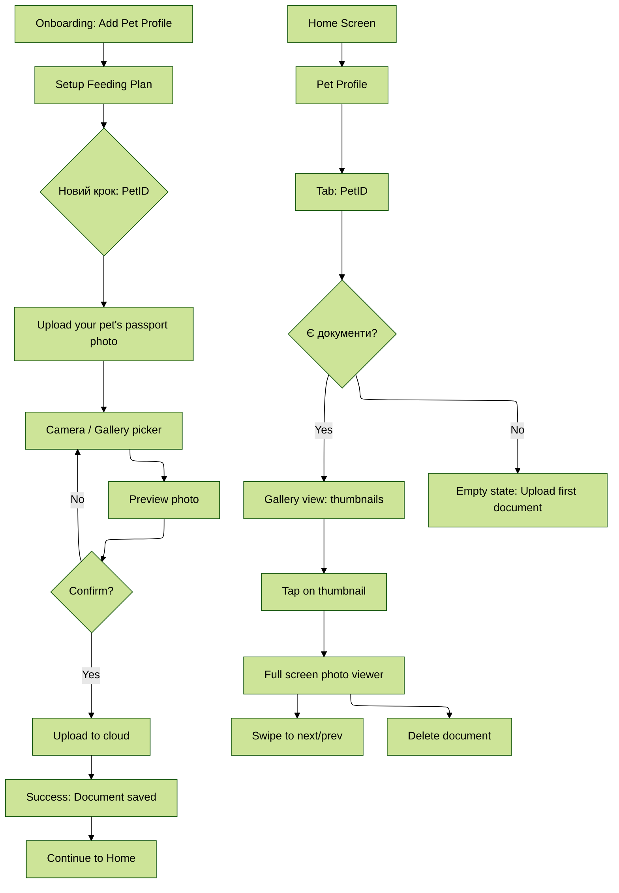

# PRD: PetID (Digital Vet Passport MVP)

**Epic A | Q1 2026 | Prototype Version**  
**Status:** Ready for Prototype  
**Last Updated:** 18 січня 2026

---

## 🎯 MVP Scope (Prototype)

**Ціль:** Створити мінімальний прототип для валідації core hypothesis: "Користувачі хочуть зберігати медичні документи тварини в додатку через фото upload."

**Що входить в MVP:**
- ✅ Photo upload ветпаспорту
- ✅ Перегляд завантажених документів
- ✅ Базова організація (по датах)
- ✅ Інтеграція в onboarding flow

**Що НЕ входить в MVP:**
- ❌ Manual entry (structured data)
- ❌ PDF export
- ❌ OCR розпізнавання
- ❌ Household sync
- ❌ Smart reminders (це Epic C)

---

## 📱 User Flow (MVP)



---

## 🎨 Ключові екрани (для прототипу)

### 1. Onboarding Step: "Upload Pet Passport"

**Layout:**
```
┌─────────────────────────────┐
│  [Skip]          Step 3/3   │
├─────────────────────────────┤
│                             │
│   [Illustration: паспорт    │
│    з камерою]               │
│                             │
│   Upload your pet's         │
│   passport                  │
│                             │
│   Keep all medical records  │
│   in one place              │
│                             │
│   ┌───────────────────┐     │
│   │  📷 Take Photo    │     │
│   └───────────────────┘     │
│                             │
│   ┌───────────────────┐     │
│   │  🖼️  Choose from   │     │
│   │     Gallery       │     │
│   └───────────────────┘     │
│                             │
│   [Skip for now]            │
│                             │
└─────────────────────────────┘
```

**Copy:**
- Title: "Upload your pet's passport"
- Subtitle: "Keep all medical records in one place"
- Primary CTA: "📷 Take Photo"
- Secondary CTA: "🖼️ Choose from Gallery"
- Skip: "Skip for now"

**Behavior:**
- Якщо user натискає "Take Photo" → відкрити камеру
- Якщо user натискає "Choose from Gallery" → відкрити gallery picker
- Якщо user натискає "Skip" → перейти до Home (можна додати пізніше)

---

### 2. Photo Preview (після вибору фото)

**Layout:**
```
┌─────────────────────────────┐
│  [Cancel]                   │
├─────────────────────────────┤
│                             │
│                             │
│   [Photo preview]           │
│   (full screen)             │
│                             │
│                             │
│                             │
├─────────────────────────────┤
│  File size: 3.2 MB          │
│  Will be compressed to 1 MB │
│                             │
│  ┌───────────────────┐      │
│  │   ✓ Upload        │      │
│  └───────────────────┘      │
│                             │
│  [Retake photo]             │
│                             │
└─────────────────────────────┘
```

**Copy:**
- Info: "File size: X MB → Will be compressed to Y MB"
- Primary CTA: "✓ Upload"
- Secondary: "Retake photo"

**Behavior:**
- Показати file size + compression info
- Якщо user натискає "Upload" → upload з progress bar
- Якщо user натискає "Retake" → повернутися до camera/gallery

---

### 3. Upload Progress

**Layout:**
```
┌─────────────────────────────┐
│                             │
│   Uploading...              │
│                             │
│   [Progress bar: 45%]       │
│                             │
│   1.4 MB / 3.2 MB           │
│                             │
│   [Cancel]                  │
│                             │
└─────────────────────────────┘
```

**Behavior:**
- Показати progress bar (0% → 100%)
- Показати uploaded / total size
- Дозволити cancel (якщо user передумав)

---

### 4. Upload Success

**Layout:**
```
┌─────────────────────────────┐
│                             │
│   [Checkmark animation]     │
│                             │
│   Document uploaded!        │
│                             │
│   (Auto-close after 2s)     │
│                             │
└─────────────────────────────┘
```

**Behavior:**
- Показати checkmark animation
- Auto-close після 2 секунд
- Перейти до Home або PetID tab

---

### 5. PetID Tab (Empty State)

**Layout:**
```
┌─────────────────────────────┐
│  [Back]  PetID              │
├─────────────────────────────┤
│                             │
│   [Illustration: порожня    │
│    папка з документами]     │
│                             │
│   No documents yet          │
│                             │
│   Upload your pet's         │
│   passport, vaccination     │
│   records, or medical       │
│   documents                 │
│                             │
│   ┌───────────────────┐     │
│   │  + Upload         │     │
│   │    Document       │     │
│   └───────────────────┘     │
│                             │
└─────────────────────────────┘
```

**Copy:**
- Title: "No documents yet"
- Subtitle: "Upload your pet's passport, vaccination records, or medical documents"
- CTA: "+ Upload Document"

---

### 6. PetID Tab (With Documents)

**Layout:**
```
┌─────────────────────────────┐
│  [Back]  PetID         [+]  │
├─────────────────────────────┤
│                             │
│  Documents (3)              │
│                             │
│  ┌─────┐ ┌─────┐ ┌─────┐   │
│  │ 📄  │ │ 📄  │ │ 📄  │   │
│  │     │ │     │ │     │   │
│  └─────┘ └─────┘ └─────┘   │
│  Jan 15  Dec 10  Nov 5     │
│                             │
│  ┌─────┐                    │
│  │ 📄  │                    │
│  │     │                    │
│  └─────┘                    │
│  Oct 1                      │
│                             │
└─────────────────────────────┘
```

**Layout:** Grid view (2 columns)

**Elements:**
- Thumbnail (compressed preview)
- Date (extracted from file metadata або user input)
- Floating Action Button: "+" (додати новий документ)

**Behavior:**
- Tap on thumbnail → відкрити full screen viewer
- Tap on "+" → відкрити camera/gallery picker

---

### 7. Full Screen Photo Viewer

**Layout:**
```
┌─────────────────────────────┐
│  [Back]              [⋮]    │
├─────────────────────────────┤
│                             │
│                             │
│   [Photo full screen]       │
│   (pinch to zoom)           │
│                             │
│                             │
│                             │
├─────────────────────────────┤
│  Jan 15, 2026               │
│  ← →  (swipe to next/prev)  │
└─────────────────────────────┘
```

**Features:**
- Pinch to zoom
- Swipe left/right для next/prev документу
- Menu (⋮): Delete, Share (опціонально для MVP)

**Behavior:**
- Swipe down → закрити viewer
- Tap on [⋮] → показати menu (Delete)

---

### 8. Delete Confirmation

**Layout:**
```
┌─────────────────────────────┐
│                             │
│   Delete document?          │
│                             │
│   This action cannot be     │
│   undone.                   │
│                             │
│   ┌───────────────────┐     │
│   │   Cancel          │     │
│   └───────────────────┘     │
│                             │
│   ┌───────────────────┐     │
│   │   Delete          │     │
│   └───────────────────┘     │
│                             │
└─────────────────────────────┘
```

**Behavior:**
- Якщо "Delete" → видалити з cloud + local cache
- Якщо "Cancel" → закрити dialog

---

## 🔧 Technical Specs (MVP)

### Backend API

**Endpoints:**

```typescript
// Upload document
POST /api/pets/:petId/documents
Content-Type: multipart/form-data

Request:
{
  file: File, // image file
  uploaded_at?: string // optional, default: now
}

Response:
{
  id: string,
  pet_id: string,
  file_url: string,
  thumbnail_url: string,
  file_size_bytes: number,
  uploaded_at: string
}

// List documents
GET /api/pets/:petId/documents

Response:
{
  documents: [
    {
      id: string,
      file_url: string,
      thumbnail_url: string,
      uploaded_at: string
    }
  ]
}

// Delete document
DELETE /api/pets/:petId/documents/:documentId

Response:
{
  success: boolean
}
```

### Database Schema

```sql
CREATE TABLE pet_documents (
  id UUID PRIMARY KEY,
  pet_id UUID REFERENCES pets(id) ON DELETE CASCADE,
  file_url TEXT NOT NULL,
  thumbnail_url TEXT NOT NULL,
  file_size_bytes INT NOT NULL,
  uploaded_at TIMESTAMP DEFAULT NOW(),
  created_by UUID REFERENCES users(id)
);

CREATE INDEX idx_pet_documents_pet_id ON pet_documents(pet_id);
CREATE INDEX idx_pet_documents_uploaded_at ON pet_documents(uploaded_at DESC);
```

### Mobile (React Native)

**Libraries:**
- `react-native-image-picker` - camera/gallery picker
- `react-native-image-resizer` - compression
- `@react-native-firebase/storage` - upload
- `react-native-fast-image` - image caching

**Compression Logic:**

```javascript
import ImageResizer from 'react-native-image-resizer';

const compressImage = async (uri) => {
  return await ImageResizer.createResizedImage(
    uri,
    1920, // max width
    1920, // max height
    'JPEG',
    80, // quality
  );
};
```

### Firebase Storage

**Structure:**
```
/pet-documents/{userId}/{petId}/{documentId}.jpg
/pet-documents/{userId}/{petId}/thumbnails/{documentId}_thumb.jpg
```

**Compression:**
- Original: max 1920×1920px, quality 80% (target: <1MB)
- Thumbnail: 400×400px, quality 70% (target: <100KB)

---

## ✅ Acceptance Criteria (MVP)

### Must-Have для прототипу:

**Onboarding:**
- [ ] Користувач бачить крок "Upload pet passport" після setup feeding plan
- [ ] Користувач може вибрати "Take Photo" або "Choose from Gallery"
- [ ] Користувач може skip цей крок
- [ ] Після upload користувач переходить до Home

**Upload:**
- [ ] Користувач бачить preview фото перед upload
- [ ] Користувач бачить file size + compression info
- [ ] Користувач бачить progress bar під час upload
- [ ] Користувач бачить success message після upload
- [ ] Upload займає <10 секунд для 5MB фото

**PetID Tab:**
- [ ] Користувач бачить empty state, якщо немає документів
- [ ] Користувач бачить grid з thumbnails, якщо є документи
- [ ] Thumbnails завантажуються <2 секунд
- [ ] Користувач може додати новий документ через "+" button

**Photo Viewer:**
- [ ] Користувач може відкрити full screen viewer
- [ ] Користувач може zoom in/out (pinch gesture)
- [ ] Користувач може swipe до next/prev документу
- [ ] Користувач може видалити документ

**Error Handling:**
- [ ] Якщо upload fails → показати error message + retry button
- [ ] Якщо no internet → показати "No connection" message
- [ ] Якщо file too large (>10MB) → показати "File too large" message

---

## 📊 Success Metrics (MVP)

**Primary Metric:**
- **Upload Completion Rate:** % користувачів, що успішно завантажили мін. 1 документ в onboarding
- **Target:** >40%

**Secondary Metrics:**
- **Skip Rate:** % користувачів, що skip onboarding step
- **Target:** <60%
- **Upload Success Rate:** % успішних uploads (без errors)
- **Target:** >90%
- **Repeat Usage:** % користувачів, що повертаються до PetID tab протягом 7 днів
- **Target:** >30%

**Qualitative:**
- User feedback: "Чи зрозуміло, як upload документ?"
- User feedback: "Чи корисна ця фіча?"

---

## 🚀 Prototype Timeline

**Week 1: Design**
- Day 1-2: Finalize mockups (8 екранів)
- Day 3: Design review + approval
- Day 4-5: Interactive prototype (Figma)

**Week 2: User Testing**
- Day 1-2: User testing (n=5-7)
- Day 3-4: Iterate based on feedback
- Day 5: Final prototype ready

**Deliverables:**
- ✅ Figma prototype (interactive)
- ✅ User testing report
- ✅ Refined PRD (після feedback)

---

## 🎯 Prototype Testing Plan

### User Testing (n=5-7)

**Participants:**
- 3 нових власників тварин (цуценята/кошенята)
- 2 досвідчених власників (2+ тварини)
- 2 користувачі з low digital literacy

**Tasks:**

1. **Task 1: Onboarding Upload**
   - "Ви щойно створили профіль тварини. Пройдіть onboarding."
   - Measure: чи зрозуміло, що треба робити? Чи skip?

2. **Task 2: Upload Document**
   - "Завантажте фото ветпаспорту вашої тварини."
   - Measure: чи знайшли кнопку? Скільки часу зайняло?

3. **Task 3: View Document**
   - "Знайдіть документ, який ви щойно завантажили."
   - Measure: чи зрозуміла навігація? Чи знайшли PetID tab?

4. **Task 4: Delete Document**
   - "Видаліть документ."
   - Measure: чи знайшли функцію delete? Чи зрозуміло?

**Questions:**
- "Чи зрозуміло, що таке PetID?"
- "Чи корисна ця фіча для вас?"
- "Що б ви хотіли покращити?"
- "Чи використовували б ви це в реальному житті?"

---

## 🔄 Next Steps (після прототипу)

**Якщо user testing успішний (>70% task completion):**
1. ✅ Approve для development
2. Engineering kickoff (Week 3)
3. Development (Week 3-5)
4. QA + soft launch (Week 6)

**Якщо user testing показує issues:**
1. Iterate prototype
2. Re-test (n=3-5)
3. Approve після validation

**Якщо adoption низька (<40% upload completion):**
1. Pivot: зробити upload опціональним (не в onboarding)
2. Додати більше value messaging
3. Re-test

---

## 📝 Open Questions (для прототипу)

**Design:**
- [ ] Яка ілюстрація для onboarding step? (designer)
- [ ] Яка ілюстрація для empty state? (designer)
- [ ] Чи потрібна анімація для upload success? (designer)

**UX:**
- [ ] Чи показувати date picker для uploaded_at? (Або auto-extract з file metadata?)
- [ ] Чи дозволити додавати notes до документу? (Або skip для MVP?)
- [ ] Чи потрібна функція Share? (Або skip для MVP?)

**Technical:**
- [ ] Чи генерувати thumbnails на backend чи на client? (engineering)
- [ ] Чи кешувати images на пристрої? (engineering)

---

## 🎨 Design Assets Needed

**Illustrations:**
1. Onboarding step: паспорт з камерою (hero illustration)
2. Empty state: порожня папка з документами
3. Upload success: checkmark animation

**Icons:**
- 📷 Camera icon
- 🖼️ Gallery icon
- ➕ Add document icon
- 🗑️ Delete icon
- ⋮ Menu icon

**Colors:**
- Primary: (з existing design system)
- Success: green (для checkmark)
- Error: red (для error messages)

---

## ✂️ Out of Scope (для MVP)

**Features відкладені на V2:**
- ❌ Manual entry (structured data: дата, назва вакцини, клініка)
- ❌ PDF export
- ❌ OCR розпізнавання тексту
- ❌ Household sync (auto-sync між пристроями)
- ❌ Smart reminders (це Epic C)
- ❌ Search/filters (по даті, типу документу)
- ❌ Tags/categories (вакцинація, аналізи, рецепти)
- ❌ Share з ветклініками
- ❌ Bulk upload (multiple photos at once)

**Rationale:** MVP фокусується на core value: "upload photo → view photo". Все інше — додаткові фічі, які можна додати після validation.

---

## 🎯 MVP Hypothesis

**Hypothesis:**

"Якщо ми додамо можливість завантажувати фото ветпаспорту в onboarding, то >40% користувачів завантажать мін. 1 документ, тому що вони хочуть мати медичну інформацію завжди під рукою."

**Validation Criteria:**
- ✅ Upload completion rate >40%
- ✅ Skip rate <60%
- ✅ User feedback: "корисна фіча" (>70% positive)

**If validated:**
→ Ship V1 з photo upload  
→ Додати manual entry в V2  
→ Додати PDF export в V3

**If not validated:**
→ Iterate UX (можливо, delayed prompt замість onboarding)  
→ Додати більше value messaging  
→ Re-test

---

**Status:** ✅ Ready for Prototype  
**Owner:** Product Designer (Oksana)  
**Next Step:** Create Figma prototype (Week 1)  
**Review Date:** End of Week 2 (після user testing)

---

**Attachments:**
- [Original PRD](./epic-a-digital-vet-passport-prd.md) — повна версія
- [Critical Questions](./epic-a-critical-questions.md) — рішення по scope
- [Engineering Review](./epic-a-review-engineer.md) — технічний контекст
- [Executive Review](./epic-a-review-executive.md) — бізнес контекст
- [User Research Review](./epic-a-review-user-researcher.md) — UX контекст
